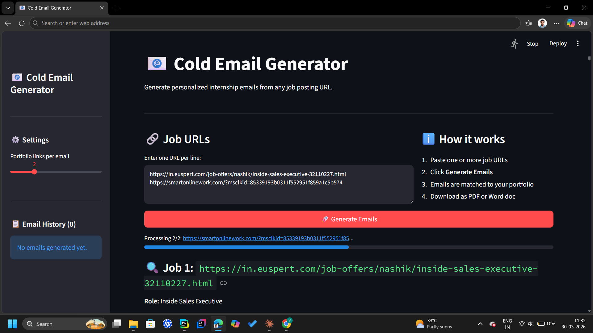

# 📧 Cold Email Generator

An AI-powered tool that scrapes job postings from any URL and instantly generates personalized cold emails tailored to your skills and portfolio — built with **Streamlit**, **LangChain**, **Groq (Llama 3.3 70B)**, and **ChromaDB**.

---
<p align="center">
  
</p>

---

## ✨ Features

- 🔗 **Multi-URL support** — paste multiple job links and generate all emails in one click
- 🤖 **AI-powered extraction** — automatically extracts role, required skills, and description from any job page
- 📁 **Portfolio matching** — ChromaDB semantically matches your portfolio projects to the job's tech stack
- 📋 **Email history** — all generated emails saved in the sidebar for the session
- ⬇️ **Export to PDF & Word** — download any email as a `.pdf` or `.docx` file
- ⚙️ **Configurable** — control how many portfolio links are included per email

---

## 🖼️ Demo

> *(Add a screenshot or GIF here once you run the app)*

---

## 🗂️ Project Structure

```
cold-email-generator/
├── main.py           # Streamlit app (UI + orchestration)
├── chains.py         # LangChain chains (job extraction + email writing)
├── portfolio.py      # ChromaDB vector store for portfolio links
├── utils.py          # Text cleaning + PDF/DOCX export helpers
├── my_portfolio.csv  # Your portfolio: tech stacks + project links
├── requirements.txt
├── .env              # API keys (not committed)
└── .gitignore
```

---

## ⚡ Quick Start

### 1. Clone the repo

```bash
git clone https://github.com/YOUR_USERNAME/cold-email-generator.git
cd cold-email-generator
```

### 2. Create a virtual environment

```bash
python -m venv .venv
# Windows
.venv\Scripts\activate
# macOS/Linux
source .venv/bin/activate
```

### 3. Install dependencies

```bash
pip install -r requirements.txt
```

### 4. Set up your API key

Create a `.env` file in the project root:

```env
GROQ_API_KEY=your_groq_api_key_here
USER_AGENT=cold-email-generator/1.0
```

Get a free Groq API key at [console.groq.com](https://console.groq.com).

### 5. Update your portfolio

Edit `my_portfolio.csv` to add your real projects:

```csv
"Techstack","Links"
"Python, Machine Learning, TensorFlow","https://github.com/you/ml-project"
"React, Node.js, MongoDB","https://github.com/you/web-app"
```

### 6. Run the app

```bash
streamlit run main.py
```

---

## 🛠️ Tech Stack

| Layer | Technology |
|---|---|
| UI | Streamlit |
| LLM | Groq — Llama 3.3 70B Versatile |
| Orchestration | LangChain |
| Vector DB | ChromaDB |
| Web scraping | LangChain WebBaseLoader |
| PDF export | ReportLab |
| Word export | python-docx |

---

## 🔧 Customization

**Change the persona** — open `chains.py` and edit the `write_mail` prompt. Replace Vaibhav's details with your own name, degree, and skills.

**Change the LLM model** — in `chains.py`, update `model_name`. Any model supported by Groq works.

**Add more portfolio entries** — just add rows to `my_portfolio.csv` and delete the `vectorstore/` folder to rebuild the index.

---

## 📄 License

MIT — free to use, fork, and adapt.

---

## 🙌 Acknowledgements

Inspired by the [codebasics](https://github.com/codebasics) project structure. Extended with multi-URL support, history, and export features.
